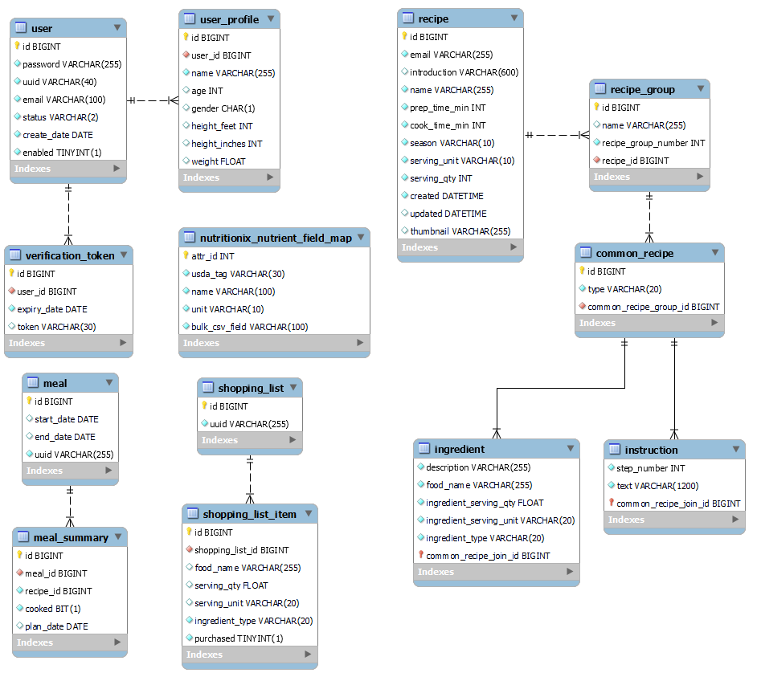

# wildfit-server

REST server for WILDFIT application

The WILDFIT app is an innovative solution to support
individuals on their health and wellness journey.

# Documentation

Swagger provides the API documentation.  
Run the application and point a browser to http://localhost:8080/swagger-ui.html

# Run the Application

Run the following command in a terminal window:

```bash
mvn spring-boot:run -Dspring-boot.run.profiles=dev
```

# Config

Only the application.properties file is stored in Git.  
The rest are local files to prevent leaking sensitive information.

* src/main/resources/application.properties
    * Common configuration values
* src/main/resources/application-dev.properties
    * Development configuration values
* flyway.conf
    * Flyway configuration

# Wildfit Server uses https://www.nutritionix.com/business/api

Required HEADERS when accessing Nutritionix V2 API endpoints:

* x-app-id: Your app ID issued from developer.nutritionix.com
* x-app-key: Your app key issued from developer.nutritionix.com
* x-remote-user-id:  A unique identifier to represent the end-user who is accessing the Nutritionix API. If in
  development mode, set this to 0. This is used for billing purposes to determine the number of active users your app
  has.

Please note, when authenticating with the API, you must send the x-app-id and x-app-key params as headers, and not as
query string parameters.

# Test

run `mvn test -Dspring.profiles.active=dev` to run all JUnit tests.

The current test environment utilizes SpringBootTest, JsonTest and Mockito to achieve a 93% test coverage.

# Database

The original design had a table for recipe instructions and another table for ingredients.

* 9 ingredients
* 4 instructions

Query for the ingredients and the instructions based on recipe id resulted in the cartesian product (4 * 9) of 36 rows.

The way to solve this is by a joined table strategy:

1. Use an abstract parent class
2. Add an enum stored in the database as text depicting the child class type
3. Use PrimaryKeyJoinColumn annotation and provide the same name in child classes

Separate tables are created for the parent and child classes.

The primary id of the child classes are the primary key of the parent class.  
This ensures unique key values between the child classes.  
Otherwise would need a compound index to ensure uniqueness.

Storing the enum name is better than the default enum number because if someone inserts a
new enum value the database does not have to be updated with the new number.

Query for the parent class returns 13 rows.  
Accessing the data returns 9 ingredients and 4 instructions.
The enum provides efficient mapping of the database row to a Java class.


